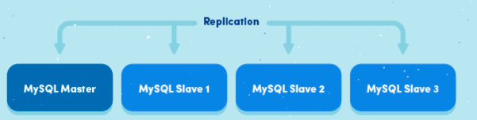
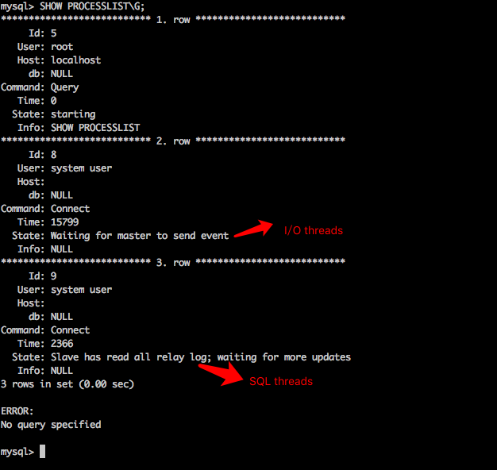

## Mysql主从同步的原理
* https://segmentfault.com/a/1190000008663001

### 1、什么是mysql主从同步？
* 当 master(主)库 的数据发生变化的时候，变化会实时的同步到 slave(从)库.

### 2、主从同步有什么好处？
* 水平扩展数据库的负载能力;

* 容错，高可用。Failover(失败切换)/High Availability;

* 数据备份

### 3、主从同步的原理是什么？
* 首先我们来了解 __master-slave__ 的体系结构

* 如下图：

* 不管是 *delete、update、insert，还是创建函数、存储过程*，所有的操作都在master上。当 master 有操作的时候,slave 会快速的接收到这些操作，从而做同步。

* 但是，这个 __机制__ 是怎么实现的呢？
    * 在 master 机器上，*主从同步事件* 会被写到特殊的 log 文件中(binary-log);
    * 在 slave 机器上，slave *读取主从同步事件*，并根据读取的事件变化，在 slave 库上做相应的更改.

#### 3.1主从同步事件有哪些
* 主从同步事件有3种形式 : statement 、 row 、mixed
    * statement：会将对数据库操作的sql语句写入到 binlog 中;
    * row：会将每一条数据的变化写入到 binlog 中;
    * mixed：statement 与 row 的混合。Mysql决定什么时候写 statement 格式的，什么时候写 row 格式的binlog

#### 3.2在master机器上的操作
* 当 master上的数据发生改变的时候，该事件(insert、update、delete)变化会按照顺序写入到 binlog 中。

* **binlog dump线程**
    * 当 slave 连接到 master 的时候，master 机器会为 slave 开启 **binlog dump 线程**;
    * 当 master 的 binlog 发生变化的时候，**binlog dump 线程** 会通知 slave，并将相应的 binlog内容发送给 slave.

#### 3.3在slave机器上的操作
* 当主从同步开启的时候，slave上会创建2个线程：
    * **I/O线程**: 该线程连接到 master 机器，master 机器上的 binlog dump 线程会将 binlog 的内容发送给该 I/O线程。该 I/O线程接收到 binlog 内容后，再将内容写入到本地的relay log;
    * **SQL 线程**: 该线程读取I/O线程写入的 relay log。并且根据 relay log 的内容对 slave 数据库做相应的操作.

#### 3.4如何在master、slave上查看上述的线程？
* 使用 `SHOW PROCESSLIST` 命令可以查看.

* 如图，在 master 机器上 **查看 binlog dump 线程**

* 如图，在 slave 机器上查看I/O、SQL线程:

### 4、讲了这么多，一图以蔽之

### 5、关于实战
关于实战，请参考我的另一篇文章：Mysql主从同步实战 (https://segmentfault.com/a/1190000008663587)

### 6、参考文章
What is MySQL Replication and How Does It Work? (http://dbadiaries.com/what-is-mysql-replication-and-how-does-it-work)
MySQL Master-Slave Replication on the Same Machine (https://www.toptal.com/mysql/mysql-master-slave-replication-tutorial)
