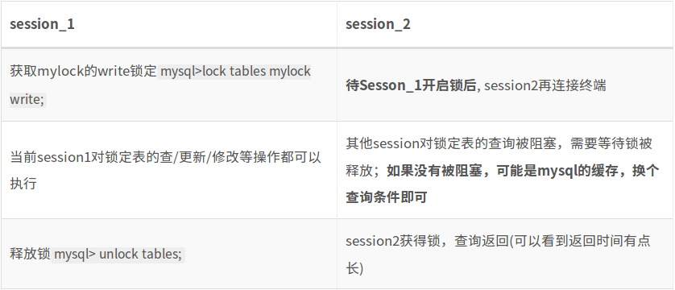

## MySQL锁机制
* http://liucw.cn/2018/01/22/mysql/MySQL%E9%94%81%E6%9C%BA%E5%88%B6/

* __锁__ 是计算机协调多个进程或线程并发访问某一资源的机制。

* 在数据库中，除传统的计算资源(如CPU、RAM、I/O等)的争用以外，数据也是一种供许多用户共享的资源。_如何保证数据并发访问的一致性、有效性是所有数据库必须解决的一个问题_，锁冲突也是影响数据库并发访问性能的一个重要因素。从这个角度来说，锁对数据库而言显得尤其重要，也更加复杂。


### 锁的分类
* __开锁、加锁速度、死锁、粒度、并发性能只能就具体应用的特点来说哪种锁更合适__

* 1、从对数据操作的类型(读\写)分
    * 读锁(__共享锁__): 针对同一份数据，多个读操作可以同时进行而不会互相影响
    * 写锁(__排它锁__): 当前写操作没有完成前，它会阻断其他写锁和读锁

* 2、从对数据操作的粒度分
    * __表锁__ (偏读) -- TODO:不理解读为什么要锁?
    * __行锁__ (偏写)
    * 页锁(了解)


### 表锁 (偏读)
* mysql 的表级锁有两种模式：
    * 表共享读锁(Table Read Lock)
    * 表独占写锁(Table Write Lock)

* 特点：
    * 偏向 __MyISAM__ 存储引擎，开销小，加锁快； 
    * 无死锁； 
    * 锁定粒度大，发生锁冲突的概率最高，并发度最低;
    * MyISAM 在执行查询语句前，会自动给涉及的所有表加 __读锁__，在执行增删改操作前，会自动给涉及的表加 __写锁__
    * __读锁__ 会被阻塞写，但不会阻塞写; 而 __写锁__ 则会把读和写都阻塞


#### 表锁–读锁
```sql
create table mylock (
    id int not null primary key auto_increment,
    name varchar(20)
) engine myisam;    // 这里用MyISAM存储引擎

* 类似再建一个book表和

【手动增加表锁】lock table 表名字 read(write), 表名字2 read(write), 其他;
【释放锁】unlock tables;
【查看表上加过的锁】show open tables;

mysql> lock table mylock read, book write;
mysql> show open tables;
+----------+-------+--------+-------------+
| DATABASE | TABLE | In_use | Name_locked |
+----------+-------+--------+-------------+
| dbtest   | book  |      1 |           0 |
+----------+-------+--------+-------------+
| dbtest   | mylock|      1 |           0 |
+----------+-------+--------+-------------+
·Database：含有该表的数据库。
·Table：表名称。
·In_use：表当前被查询使用的次数。如果该数为零，则表是打开的，但是当前没有被使用。
·Name_locked：表名称是否被锁定。名称锁定用于取消表或对表进行重命名等操作。

mysql> update mylock set name='a2' where id=1;
ERROR 1099(HY000): Table 'mylock' was locked with a READ lock and can't be updated

* 如果是另外一个session2执行上面的 update 语句，不会报错，sql 被阻塞从而一直在等待，直到被锁的 session 执行 unlock tables 才会执行。
```


#### 表锁–写锁
* 我们为 mylock 表加 write 锁(myisam存储引擎的写阻塞读例子)

* 


#### 表锁分析
* 【查看哪些表被加锁了】`mysql> show open tables;`

* 【如何分析表锁定】下面分析:
```sql
mysql> show status like 'tables%';
+------------------------+-------+
| Variable_name          | TABLE |
+------------------------+-------+
| Table_locks_immediate  | 105   |
+------------------------+-------+
| Table_locks_waited     | 1     |
+------------------------+-------+
```
* 这里有两个状态变量记录 MySQL 内部表级锁定的情况，两个变量说明如下：
    * a).Table_locks_immediate: 产生表级锁定的次数，表示可以立即获取锁的查询次数，每立即获取锁值加1
    * b).Table_locks_waited: 出现表级锁定争用而发生等待的次数(不能立即获取锁的次数，每等待一次锁值加1)，此值高则说明存在着较严重的表级锁定争用情况。

* 此外，__MyISAM 的读写锁调度是写优先，这也是 myisam 不适合做写为主的引擎__。因为写锁后，其他线程不能做任何操作，大量的更新会使查询很难得到锁，从而造成永远阻塞


### 行锁(偏写)
* 特点：    
    * 偏向 __InnoDB___存储引擎，开销大，加锁慢；
    * 会出现死锁；锁定粒度最小，发生锁冲突的概率最低，并发度也最高。
    * InnoDB 与 MyISAM 的最大不同有两点：
        * 一是支持 __事务__；
        * 二是采用 __了行级锁__

> 虽然InnoDB引擎的表可以用行级锁，但这个 __行级锁的机制依赖于表的索引__，如果表没有索引，或者 _sql语句没有使用索引，那么仍然使用表级锁_


#### 复习事务
1. 事务及其ACID属性
    * A (Atomicity)代表 __原子性__，即事务是一个原子操作单元，对数据的修改，_要么全部执行，要么一个都不执行_;

    * C (Consistency)代表一致性，在事务开始和完成时，数据都必须保持一致状态。这意味着所有相关的数据规则都必须应用于事务的修改，以保持数据的完整性；事务结束时，所有的内部数据结构(如B树索引或双向链表)也必须是正确的。
        * 如转账业务，无论事务执行成功与否，参与转账的两个账号余额之和应该是不变的。

    * I (Isolation)代表隔离性，即两个事务不会相互影响、覆盖彼此数据等;

    * D (Durability)表示持久化，即一旦事务提交后，它所做的修改将会永久的保存在数据库上，即使出现宕机也不会丢失。


2. 并发事务处理带来的问题
    * 对于 _同时运行的多个事务_, 当这些事务访问数据库中相同的数据时, 如果没有采取必要的隔离机制, 就会导致各种并发问题:

    * a).更新丢失: 当两个或多个事务选择同一行，然后基于选定的值更新该行时，由于每个事务都不知道其他事务的存在，就会发生丢失更新问题：最后的更新覆盖了由其他事务所做的更新。

    * b).脏读: 对于两个事物 T1, T2, T1 读取了已经被 T2 更新但尚未提交 的字段. 之后, 若 T2 回滚, T1读取的内容就是临时且无效的。也就是读取了其他事务还没有提交的数据

    * c).不可重复读: 对于两个事物 T1, T2, T1 读取了一个字段, 然后 T2 更新了该字段. 之后, T1再次读取同一个字段, 值就不同了。当前事务已经读取的数据记录，被其他事务修改或删除。

    * d).幻读: 对于两个事物 T1, T2, T1从一个表中读取了一个字段, 然后T2在该表中 新增了 一些新的行. 之后, 如果T1再读取同一个表, 就会多出几行。其他事务插入了新的数据，当前事务以相同的查询条件，在那个事务插入数据之前和之后查询数据，得到的数据条数不一样


3. 事务隔离级别
    * 隔离级别（isolation level），是指事务与事务之间的隔离程度。

    * 显然，事务隔离程度越高，并发性越差、性能越低；事务隔离程度越低，并发性越强、性能越高。

    * Mysql 支持4种事务隔离级别. Mysql 默认的事务隔离级别为: REPEATABLE READ
        * a).read uncommitted(读未提交数据)：允许事务读取未被其他事物提交的变更。脏读、不可重复读和幻读的问题都会出现

        * b).read commited(读已提交数据)：只允许事务读取已经被其他事务提交的变更。可避免脏读，但不可重复读和幻读问题仍然存在

        * c).repeatable read(可重复读)：确保事务可以多次从一个字段中读取相同的值，在这个事务持续期间，禁止其他事务对这个字段进行更新。可避免脏读和不可重复读，但幻读的问题仍然存在

        * d).serializable(串行化)：确保事务可以从一个表中读取相同的行，在这个事务持续期间，禁止其他事务对该表执行增删改操作。所有的并发问题都可以避免，但性能什么低下。

* 查看当前数据库的事务隔离级别： `show variables like 'tx_isolation'`


#### 案例分析
* 由于 mysql 的 innodb 的 sql 操作默认是 __自动提交__ 的，所以测试要关闭自动提交 `set autocommit=0`;

* 建表SQL,初始数据:
```sql
create table test_row_lock (id int(11), name varchar(16), phone varchar(11)) engine=innodb;
create index idx_id  on test_row_lock(id);  
create index idx_name  on test_row_lock(name);
insert into test_row_lock values(1, 'aa', '10081');
insert into test_row_lock values(2, 'bb', '10082');
insert into test_row_lock values(9, 'ff', '10086');
```

* **索引失效或没有使用索引 行锁变表锁**:
    * 需要打开两个session, 分别为session1和session2.

    ```sql
    (下面以更新为测试，删除和增加效果类似)
    例子1：使用索引的行锁操作
    session1 上操作
    mysql> update test_row_lock set phone='100bb' where id=2;

    session2 上操作
    mysql> update test_row_lock set phone='100aa' where id=1;

    // 现象：session1没有commit,这里也会立即执行，不会阻塞
    ----------------------------------------------------------

    例子2：索引失效，行锁变表锁
    session1 上操作，下面的这个语句索引失效
    mysql> update test_row_lock set phone='100bb' where name like '%b%';

    session2 上操作同上，这里主要看这条语句会不会立即执行
    mysql> update test_row_lock set phone='100aa' where id=1;

    // 现象：这里会一直【阻塞】，只有session1上执行 commit 命令后，这条语句才会执行。
    ```


* __间隙锁危害__
    * 【什么是间隙锁】
        * 当我们用范围条件而不是相等条件检索数据，并请求共享或排他锁时，InnoDB会给符合条件的已有数据记录的索引项加锁；对于键值在条件范围内但并不存在的记录，叫做”间隙(GAP)”.

        * InnoDB也会对这个”间隙”加锁，这种锁机制就是所谓的间隙锁(Next-Key锁).
        
    * 【危害】
        * 因为Query执行过程中通过范围查找的话，它会锁定整个范围内所有的索引键值，即使这个键值产不存在。

        * 间隙锁有一个比较致命的弱点，就是当锁定一个范围键值之后，即使某些不存在的键值也会被锁定，而造成在锁定的时候无法 插入 锁定键值范围内的任何数据。在某些场景下这可能会对性能造成很大的危害。
    
    * eg:
    ```sql
    还是使用上面的初始数据
    # session1 上操作
    mysql> update test_row_lock set phone='123456' where id>2 and id<9;

    # session2 上操作同上，这里主要看这条语句会不会立即执行
    mysql> insert into test_row_lock values(7, 'ff', '100ff');
    // 现象：这里会一直【__阻塞__】，只有session1上执行 commit 命令后，这条语句才会执行。
    ```


* __如何锁定一行__
    * `select xxx... for update;` (select 锁定)锁定某一行后，其他的操作会被阻塞，直到锁定行的会话提交 commit；

    * eg:
    ```sql
    # session1 上操作
    mysql> begin;
    mysql> select * from test_row_lock where id=1 for update;

    # session2 上操作，这里主要看这条语句会不会立即执行
    mysql> update test_row_lock set phone='100aaa' where id=1;  
    // 现象：这里会一直【__阻塞__】，只有 session1 上执行 commit 命令后，这条语句才会执行。
    ```


* __行锁分析__
    * InnoDB 存储引擎由于实现了行级锁定，虽然在锁定机制的实现方面所带来的性能损耗可能比表级锁定会要更高一些，但是在整体并发处理能力方面要远远优于 MyISAM 的表级锁定。_当系统并发量较高的时候，Innodb 的整体性能和 MyISAM 相比就会有明显的优势了_。

    * 但是，Innodb 的行级锁定同样也有其脆弱的一面，当我们使用不当的时候，可能会让 Innodb 的整体性能表现的比 MyISAM 差

    * eg:
    ```sql
    // 分析行锁定命令
    mysql> show status like 'innodb_row_lock%';
    +-------------------------------+-------+
    | Variable_name                 | Value |
    +-------------------------------+-------+
    | Innodb_row_lock_current_waits | 0     |
    | Innodb_row_lock_time          | 76100 |
    | Innodb_row_lock_time_avg      | 10871 |
    | Innodb_row_lock_time_max      | 20552 |
    | Innodb_row_lock_waits         | 7     |
    +-------------------------------+-------+
    
    Innodb_row_lock_current_waits：当前等待锁的数量
    Innodb_row_lock_time：系统启动到现在锁定的总时间长度(重要)
    Innodb_row_lock_time_avg：每次等待所花平均时间(重要)
    Innodb_row_lock_time_max：系统启动到现在 等待最长的一次所花的时间
    Innodb_row_lock_waits：系统启动到现在 总共等待的次数(重要)

    * 当等待次数很高，而且每次等待时长也不小的时候，我们就需要分析系统中为什么会有如此多的等待，然后根据分析结果着手指定优化计划
    ```

* __优化建议__
    * 尽可能让所有数据检索都通过 __索引__ 来完成，避免无索引行锁升级为表锁
    * 合理设计索引，尽量缩小锁的范围
    * 尽可能较少检索条件，避免间隙锁
    * 尽量控制事务大小，减少锁定资源量和时间长度
    * 尽可能低级别事务隔离


### 页锁(了解)
* 开销和加锁时间界于表锁和行锁之间； 会出现死锁；锁定粒度界于表锁和行锁之间，并发度一般
