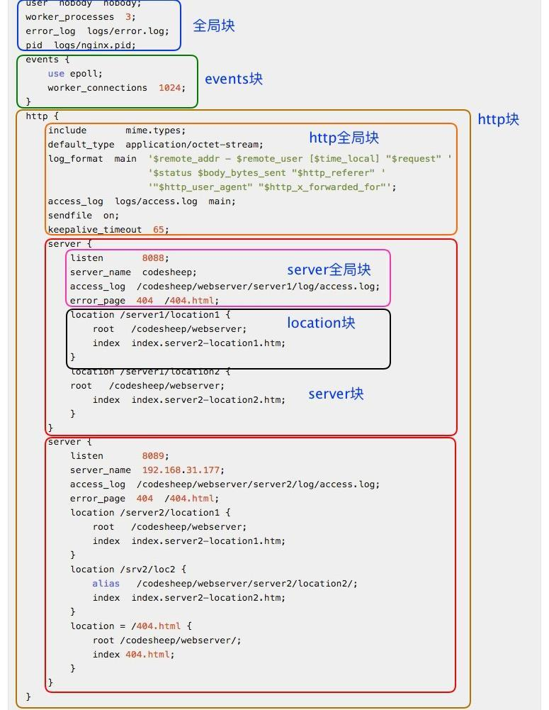

## 参考
* https://www.v2ex.com/t/465840


## 基本指令
* `/etc/nginx/nginx.conf` 配置文件

* `nginx -h` 查看帮助

* `sudo nginx -t` 测试文件是否正确

* `sudo nginx -c /etc/nginx/nginx.conf` 指定配置文件启动

* `sudo nginx -s reload` 重新载入配置文件

* `sudo nginx -s reopen` 重启 Nginx

* service 管理 nginx
```shell
v@v1:~$ sudo service nginx
Usage: nginx {start|stop|restart|reload|force-reload|status|configtest|rotate|upgrade}
```


## 多站点多配置文件
* 默认放在 `/etc/nginx/conf.d` 命名 `xx.conf`

* eg: www.conf
```conf
server {
    listen 80;
    root /var/www/;
    index index.php index.html;
    server_name www.test.test;

    # 测试 php-cgi 和 php-fpm 的效率区别
    location ~ \.php$ {
        include snippets/fastcgi-php.conf;
        fastcgi_pass unix:/run/php/php7.0-fpm.sock;
    }
}
```

## 配置清单
1. 全局块 -- 该部分配置主要影响 Nginx 全局，通常包括下面几个部分：
    * 配置运行 Nginx 服务器用户（组）
    * worker process 数
    * Nginx 进程 PID 存放路径
    * 错误日志的存放路径
    * 配置文件的引入

2. events 块 -- 该部分配置主要影响 Nginx 服务器与用户的网络连接，主要包括：
    * 设置网络连接的序列化
    * 是否允许同时接收多个网络连接
    * 事件驱动模型的选择
    * 最大连接数的配置

3. http 块
    * 定义 MIMI-Type
    * 自定义服务日志
    * 允许 sendfile 方式传输文件
    * 连接超时时间
    * 单连接请求数上限

4. server 块
    * 配置网络监听
    * 基于名称的虚拟主机配置
    * 基于 IP 的虚拟主机配置

5. location 块
    * location 配置
    * 请求根目录配置
    * 更改 location 的 URI
    * 网站默认首页配置

* 
