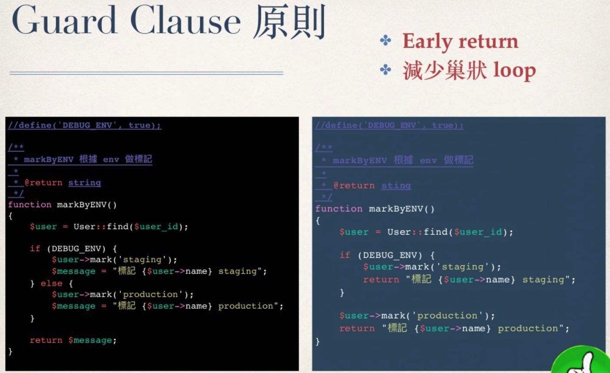
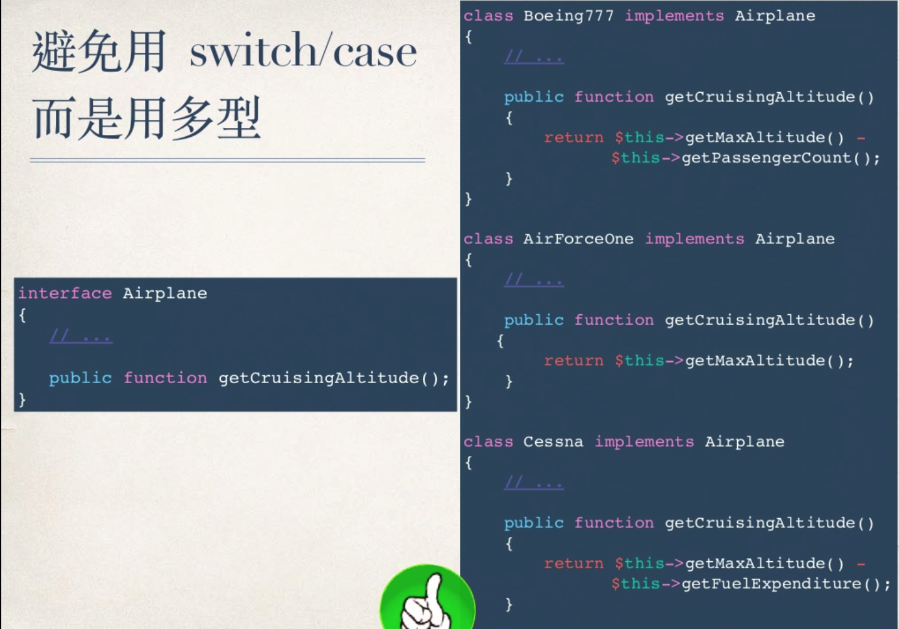

## 目录
* https://kylinyu.win/php_best_practice

* 良好的命名

* 变数的提炼

* 简短的函式设计

* 能见度 Visibility

* 封装条件句

* Guard Clause 原则

* 查表法

## 内容
* 名词单复数: 无论是方法名 变量名都要区分单复数.

* 函数: 只做一件事 (但是这件事多低多大多小很难界定)
    * **只剩一个功能**
    * 方便测试
    * 方便重构
    * 结构清晰

* 能见度 Visibility: 没必要 public 就不要 public

* 封装条件语句:
```php
// 错误师范
if ($user->role_type == 1 && $user->data_level == 4) {
    ...
}

/**
* 正确提炼方式:
* 把 判断条件 `$user->role_type == 1 && $user->data_level == 4` 提取到独立的函数, 并赋予有意义的函数名
* 特殊意义的值使用常量代替
*/

if ($this->canDeal()) {
    ...
}

function canDeal()
{
    return ($user->role_type == Role::TYPE_ADMIN && $user->data_level == User::LEVEL_ADMIN)
}
```

* 函数命名的动词以及返回值:
    * `set` 设置属性
    * `get` 获取属性
    * `is / has`    判断, boolean
    * `check`       条件检查, boolean
    * `filter`      过滤, input/output, mixed
    * `validate`    验证是否符合预期, boolean, void, throw exception
    * `can`
    * `should`

* Guard Clause 原则: 
    * Early return
    * 减少巢状 loop
    * 

* Type Hint: php7 可用强类型检查:
```php
// PHP7以下
function xxx($user)
{
    if ($user instanceof User) {
        ...
    }
}

// PHP7
function xxx(User $user) 
{
    ...
}
```

* 避免使用 `switch/case`, 而是使用 **多态**
    * * 


* 其它:
    * 反复链接
    * 相互 Code Review, 相互提醒
    * 不断思考, 何以精炼
    * 勿矫枉过正, 良好的可读性有限

* see more: 
    * https://www.slideshare.net/kylinfish/clean-code-72688451
    * https://github.com/php-cpm/clean-code-php
    * https://laravel-china.github.io/php-the-right-way
