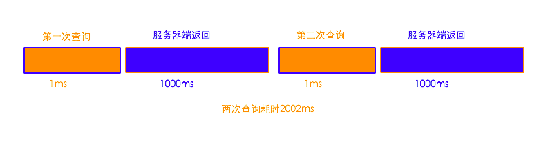
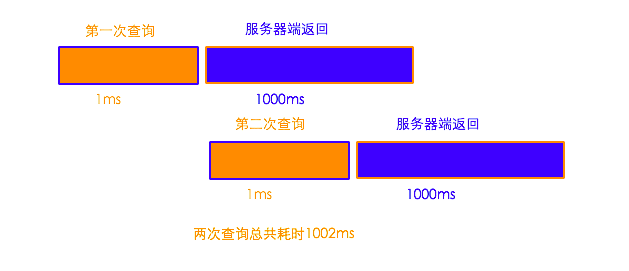

## 通过协程实现mysql查询的异步化
* https://www.bo56.com/%E9%80%9A%E8%BF%87%E5%8D%8F%E7%A8%8B%E5%AE%9E%E7%8E%B0mysql%E6%9F%A5%E8%AF%A2%E7%9A%84%E5%BC%82%E6%AD%A5%E5%8C%96/


### 前言
* 最近学习了赵海平的演讲，了解到 facebook 的 mysql 查询可以进行异步化，从而提高性能。由于 facebook 实现的比较早，他们不得不对 php 进行 hack 才得以实现。现在的 php5.5，已经无需 hack 就可以实现了。

* 对于一个 web 网站的性能来说，瓶颈多半是来自于数据库。一般数据库查询会在某个请求的整体耗时中占很大比例。如果能提高数据库查询的效率，网站的整体响应时间会有很大的下降。如果能实现 mysql 查询的异步化，就可以实现多条 sql 语句同时执行。这样就可以大大缩短 mysql 查询的耗时。


### 异步为啥比同步快？
* 与异步查询相反的时同步查询。通常情况下 mysql 的 query 查询都是同步方式。下面我们对两种方式做下对比。对比的例子是，请求两次 `select sleep(1)`。这条语句在 mysql 服务器端大概耗时 1000ms。

* 同步方式的执行流程: 

* 异步方式的执行流程: 

* 对比分析: 异步查询比同步查询速度快，是因为多条查询语句在服务器端同时执行，大大缩短了服务器端的响应时间。并行一般情况下总比串行快嘛。sql语句执行时间越长，效果越明显。


### 如何实现mysql的异步查询？
* 要实现异步查询的关键是能把发送请求和接受返回数据分开。正好mysqlnd中提供了这个特性。

* 在 mysqlnd 中对应的方法是：
    * mysqlnd_async_query 发送查询请求
    * mysqlnd_reap_async_query 获取查询结果
    * mysqli 扩展针对mysqlnd的这个特性做了封装，在调用 query 方法时，传入 `MYSQLI_ASYNC` 即可


### 为啥使用协程？
* 查看了博文中的代码实现，是不是感觉写法和平时不一样？一般在项目当中，我们都是以 function 的形式去相互调用，function 中包含了数据库查询。为了保持这个习惯，方便大家使用，因此引入了协程。在 php5.5 中正好提供了 yield 和 generator，方便我们实现协程。示例代码如下:

```php
<?php
// time php run.php
// spl_object_hash: 返回指定对象的hash id
// mysqlnd_async_query 发送异步查询请求
// mysqlnd_reap_async_query 获取异步查询结果

$gen1 = f1();
$gen2 = f2();

// TODO:为啥注释掉这两句实际就变成同步的
$gen1->current();
$gen2->current();

// TODO: 查询结果如何一一对应? 我怎么知道 current 结果 是一个用户这个sql的数据 还是 查询一篇文章的 sql 数据?
$gen1->next();
$gen2->next();

$ret1 = $gen1->current();
$ret2 = $gen2->current();

var_dump($ret1);
var_dump($ret2);

function f1()
{
    $db = new db();
    $obj = $db->async_query('select sleep(1)');
    echo "f1 async_query \n";
    yield $obj;

    $row = $db->fetch();
    echo "f1 fetch\n";
    yield $row;
}

function f2()
{
    $db = new db();
    $obj = $db->async_query('select sleep(1)');
    echo "f2 async_query\n";
    yield $obj;

    $row = $db->fetch();
    echo "f2 fetch\n";
    yield $row;
}

// 实现
function dd($val)
{
    var_dump($val);
    exit;
}

class db
{
    static $links;
    private $obj;

    public function getConn()
    {
        $host = '127.0.0.1';
        $user = 'root';
        $password = '';
        $database = '';

        $this->obj = new mysqli($host, $user, $password, $database);
        $objHash = spl_object_hash($this->obj);
        self::$links[$objHash] = $this->obj;
        return self::$links[$objHash];
    }

    public function async_query($sql)
    {
        $link = $this->getConn();
        // MYSQLI_ASYNC仅指定应用程序在等待查询结果时不应阻止。
        // 之后必须使用mysqli_poll收集结果。
        $link->query($sql, MYSQLI_ASYNC);
        return $link;
    }

    public function fetch()
    {
        for ($i = 1; $i <= 5; $i++) {
            $read = $errors = $reject = self::$links;
            // mysqli_poll — 轮询连接
            $re = mysqli_poll($read, $errors, $reject, 1);

            foreach ($read as $obj) {
                if ($this->obj === $obj) {
                    // reap_async_query — 获取异步查询的结果
                    $sql_result = $obj->reap_async_query();
                    $sql_result_array = $sql_result->fetch_array(MYSQLI_ASSOC); //只有一行
                    $sql_result->free();
                    return $sql_result_array;
                }
            }
        }
    }
}
```


### 注意
* 需要注意的是，如果 mysql 服务器本身负载很大，这种并行执行的方式就不一定是好的解决方法。因为， mysql 服务端会为每个链接创建一个单独的线程进行处理。如果创建的线程数过多，会给系统造成负担。
