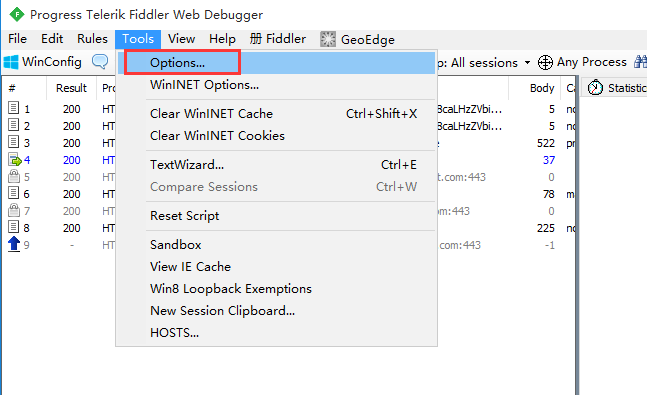
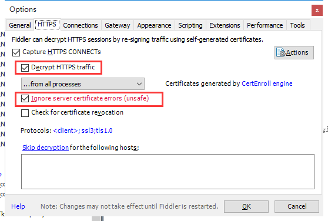
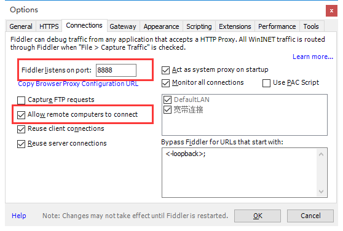
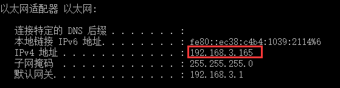
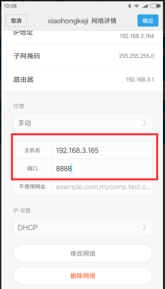

## Fiddler 4 抓包（APP HTTPS ）
* https://www.cnblogs.com/rslai/p/7794940.html

0. 导出fiddler https 证书并在手机上安装
    * Tools -> Options -> HTTPS -> Actions -> Export Root Certificate to Desktop
    * 通过微信等发到手机上, 点击安装

1. 配置fiddler
    1. 安装 fiddler，基本下一步下一步即可；
    2. 打开 fiddler，点击顶部栏 Tools -> Options
    

    3. 在 HTTPS 页签勾选 “Decrypt Https traffic” 和 “Ignore server certificate errors(unsafa)”
    

    4. 然后选择 Connections 页签勾上 “Allow remote computers to connect”，再设置一个端口号，默认8888即可
    

2. 手机配置代理服务器
    1. 在命令行窗口输入 ipconfig 查看安装 fiddler 机器的IP地址；
    

    2. 手机配置连接代理，点击手机中 “设置”Wlan -> 点击你要连接的wifi -> 长按
        * 主机名：配置为安装fiddler机器的IP地址
        * 端口：配置为fiddler中设置的端口
        
    
    3. 此时手机 app 请求的信息就可以在 fiddler 查看了。
