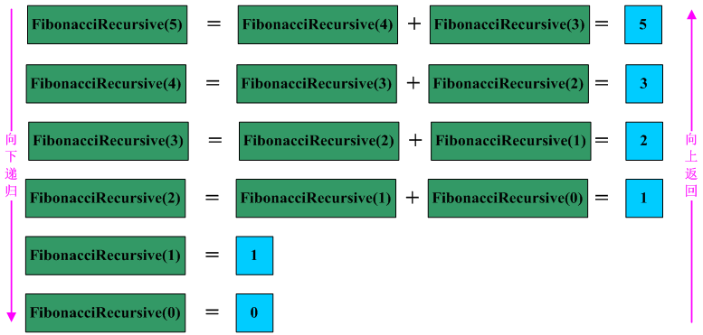

## 递归与尾递归总结
* http://www.cnblogs.com/Anker/archive/2013/03/04/2943498.html

* 前言：今天上网看帖子的时候，看到关于尾递归的应用（http://bbs.csdn.net/topics/390215312），大脑中感觉这个词好像在哪里见过，但是又想不起来具体是怎么回事。如是乎，在网上搜了一下，顿时豁然开朗，知道尾递归是怎么回事了。下面就递归与尾递归进行总结，以方便日后在工作中使用。

### 1、递归
* 关于递归的概念，我们都不陌生。简单的来说递归就是一个函数直接或间接地调用自身，是为直接或间接递归。

* 一般来说，递归需要有边界条件、递归前进段和递归返回段。当边界条件不满足时，递归前进；当边界条件满足时，递归返回。

* 用递归需要注意以下两点：
    * (1) 递归就是在过程或函数里 __调用自身__
    * (2) 在使用递归策略时，必须有一个明确的递归结束条件，称为 __递归出口__

* 递归一般用于解决三类问题：
    * (1) 数据的定义是按递归定义的。（Fibonacci函数，n的阶乘）
    * (2) 问题解法按递归实现。（回溯）
    * (3) 数据的结构形式是按递归定义的。（二叉树的遍历，图的搜索）

* 递归的缺点：
    * 递归解题相对常用的算法如普通循环等，__运行效率较低__。因此，应该 尽量避免使用递归，除非没有更好的算法或者某种特定情况，递归更为适合的时候。在递归调用的过程当中系统为每一层的返回点、局部量等开辟了栈来存储，因此递归次数过多容易造成 __栈溢出__。

* 用线性递归实现Fibonacci函数，程序如下所示： 
```c
int FibonacciRecursive(int n)
{
    if( n < 2)
        return n;
    return (FibonacciRecursive(n-1)+FibonacciRecursive(n-2));
}
```

* 递归写的代码非常容易懂，完全是根据函数的条件进行选择计算机步骤。例如现在要计算 n=5 时的值，递归调用过程如下图所示：
    * 


### 2、尾递归
* 顾名思义，__尾递归__ 就是 __从最后开始计算__, 每递归一次就算出相应的结果, 也就是说, 函数调用出现在调用者函数的尾部, 因为是尾部, 所以根本 _没有必要去保存任何局部变量_. 直接让被调用的函数返回时越过调用者, 返回到调用者的调用者去。__尾递归就是把当前的运算结果（或路径）放在参数里传给下层函数__，深层函数所面对的不是越来越简单的问题，而是越来越复杂的问题，因为参数里带有前面若干步的运算路径。

* 尾递归是极其重要的，不用尾递归，_函数的堆栈耗用_ 难以估量，需要保存很多中间函数的堆栈。
    * 比如 `f(n, sum) = f(n-1) + value(n) + sum;` 会保存 n 个函数调用堆栈;
    * 而使用尾递归 `f(n, sum) = f(n-1, sum+value(n))`; 这样则只保留后一个函数堆栈即可，之前的可优化删去。

* 采用尾递归实现Fibonacci函数，程序如下所示：
```c
int FibonacciTailRecursive(int n,int ret1,int ret2)
{
   if(n==0)
      return ret1; 
    return FibonacciTailRecursive(n-1,ret2,ret1+ret2);
}
```

* 例如现在要计算n=5时的值，尾递归调用过程如下图所示：
    * 

    * 从图可以看出，为递归不需要向上返回了，但是需要引入而外的两个空间来保持当前的结果。

* 为了更好的理解尾递归的应用，写个程序进行练习。采用直接递归和尾递归的方法求解单链表的长度，C语言实现程序如下所示：
```c
#include <stdio.h>
#include <stdlib.h>

typedef struct node
{
  int data;
  struct node* next;
}node,*linklist;

void InitLinklist(linklist* head)
{
     if(*head != NULL)
        free(*head);
     *head = (node*)malloc(sizeof(node));
     (*head)->next = NULL;
}

void InsertNode(linklist* head,int d)
{
     node* newNode = (node*)malloc(sizeof(node));
     newNode->data = d;
     newNode->next = (*head)->next;
     (*head)->next = newNode;
}

//直接递归求链表的长度 
int GetLengthRecursive(linklist head)
{
    if(head->next == NULL)
       return 0;
    return (GetLengthRecursive(head->next) + 1);
}
//采用尾递归求链表的长度，借助变量acc保存当前链表的长度，不断的累加 
int GetLengthTailRecursive(linklist head,int *acc)
{
    if(head->next == NULL)
      return *acc;
    *acc = *acc+1;
    return GetLengthTailRecursive(head->next,acc);
}

void PrintLinklist(linklist head)
{
     node* pnode = head->next;
     while(pnode)
     {
        printf("%d->",pnode->data);
        pnode = pnode->next;
     }
     printf("->NULL\n");
}

int main()
{
    linklist head = NULL;
    int len = 0;
    InitLinklist(&head);
    InsertNode(&head,10);
    InsertNode(&head,21);
    InsertNode(&head,14);
    InsertNode(&head,19);
    InsertNode(&head,132);
    InsertNode(&head,192);
    PrintLinklist(head);
    printf("The length of linklist is: %d\n",GetLengthRecursive(head));
    GetLengthTailRecursive(head,&len);
    printf("The length of linklist is: %d\n",len);
    system("pause");
}
```

* 参考：http://www.cnblogs.com/JeffreyZhao/archive/2009/03/26/tail-recursion-and-continuation.html
