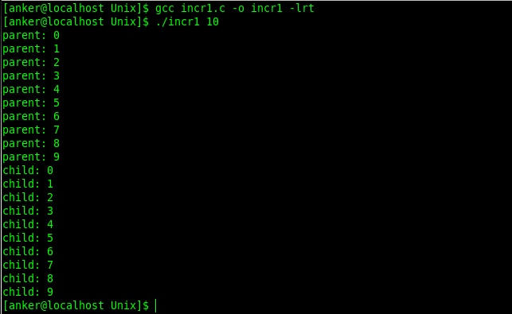
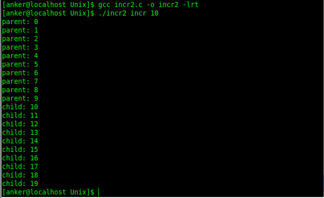

## 共享内存
* http://www.cnblogs.com/Anker/archive/2013/01/16/2862800.html

* __共享内存__ 可以说是最有用的 __进程间通信方式__，也是最快的IPC形式。两个不同进程A、B共享内存的意思是，同一块物理内存被映射到进程A、B各自的进程地址空间。进程A可以即时看到进程B对共享内存中数据的更新，反之亦然。_由于多个进程共享同一块内存区域，必然需要某种同步机制，互斥锁和信号量都可以_.

* 采用共享内存通信的一个显而易见的好处是 _效率高，因为进程可以直接读写内存，而不需要任何数据的拷贝_。对于像 _管道_ 和 _消息队列_ 等 _通信方式_，则需要在内核和用户空间进行四次的数据拷贝，而共享内存则只拷贝两次数据[1]：一次从输入文件到共享内存区，另一次从共享内存区到输出文件。实际上，进程之间在共享内存时，并不总是读写少量数据后就解除映射，有新的通信时，再重新建立共享内存区域。而是保持共享区域，直到通信完毕为止，这样，数据内容一直保存在共享内存中，并没有写回文件。共享内存中的内容往往是在解除映射时才写回文件的。因此，采用共享内存的通信方式效率是非常高的。

* 默认情况下通过 `fork` 派生的子进程并不与父进程共享内存区。通过一个程序来验证，程序功能是让父子进程都给一个名为 count 的全局变量加1操作，程序如下：
```c incr1.c
#include <stdio.h>
#include <stdlib.h>
#include <unistd.h>
#include <sys/types.h>
#include <semaphore.h>
#include <fcntl.h>

#define   SEM_NAME         "mysem"
#define   FILE_MODE   (S_IRUSR | S_IWUSR | S_IRGRP | S_IROTH)

// 全局变量
int   count = 0; 

int main(int argc,char* argv[])
{
    int  i,nloop;
    sem_t *mutex;
    
    if (argc != 2) {
        printf("usage: incrl <#loops>");
        exit(0);
    }

    nloop = atoi(argv[1]);
    
    // 创建有名信号量
    mutex = sem_open(SEM_NAME,O_RDWR|O_CREAT|O_EXCL,FILE_MODE,1);
    sem_unlink(SEM_NAME);
    
    // 将stdout设置为非缓冲的
    setbuf(stdout,NULL);

    // 子进程开始执行增加1
    if (fork() == 0) {
        for (i = 0; i<nloop; ++i) {
            sem_wait(mutex);
            printf("child: %d\n",count++);
            sem_post(mutex);
        }

        exit(0);
    }
    
    //父进程执行增加1操作
    for (i = 0; i<nloop; ++i) {
        sem_wait(mutex);
        printf("parent: %d\n",count++);
        sem_post(mutex);
    }
    
    //等待子进程退出
    wait(NULL); 
    exit(0);
}
```

* 例子执行: `gcc incr1.c -o incr1 -lpthread` && `./incr1 5`
    * 执行结果: 

* 从结果可以看出父子进程都有各自的全局变量 count 的副本，每个进程都从该变量为 0 的初始值开始的，每次增加的对象是各自的变量的副本。


### 共享内存操作函数：
1. 系统调用 `mmap()`
    * `void* mmap (void * addr, size_t len, int prot, int flags, int fd , off_t offset)`

　  * mamap 函数把一个文件或一个 Posix 共享内存区对象映射到调用进程的地址空间。
        * 参数 fd 为即将映射到进程空间的文件描述字，一般由 open() 返回，同时，fd 可以指定为 -1，此时须指定 flags 参数中的 MAP_ANON，表明进行的是匿名映射（不涉及具体的文件名，避免了文件的创建及打开，很显然只能用于具有亲缘关系的进程间通信）。

        * len 是映射到调用进程地址空间的字节数，它从被映射文件开头 offset 个字节开始算起。prot 参数指定共享内存的访问权限。可取如下几个值的或：PROT_READ（可读） , PROT_WRITE （可写）, PROT_EXEC （可执行）, PROT_NONE（不可访问）。

        * flags由以下几个常值指定：MAP_SHARED , MAP_PRIVATE , MAP_FIXED，其中，MAP_SHARED , MAP_PRIVATE必选其一，而MAP_FIXED则不推荐使用。

        * offset 参数一般设为0，表示从文件头开始映射。

        * 参数addr指定文件应被映射到进程空间的起始地址，一般被指定一个空指针，此时选择起始地址的任务留给内核来完成。函数的返回值为最后文件映射到进程空间的地址，进程可直接操作起始地址为该值的有效地址。

2. 系统调用 `munmap()`
　  * `int munmap(void * addr, size_t len)`

　  * munmap 函数从某个进程的地址空间中删除一个映射关系。
        * addr 是调用mmap()时返回的地址，len是映射区的大小。
        * 当映射关系解除后，对原来映射地址的访问将导致段错误发生。

3. 系统调用 `msync()`
　  * `int msync(void * addr, size_t len, int flags)`

　　* 一般说来，进程在映射空间的对共享内容的改变并不直接写回到磁盘文件中，往往在调用 munmap() 后才执行该操作。可以通过调用 msync() 实现磁盘上文件内容与共享内存区的内容一致。


* 现使用共享内存实现在内存映射文件中个计数器持续加1，程序如下所示：
```c incr2.c
#include <stdio.h>
#include <stdlib.h>
#include <unistd.h>
#include <sys/types.h>
#include <semaphore.h>
#include <fcntl.h>
#include <sys/mman.h>
#include <errno.h>

#define   SEM_NAME         "mysem"
#define   FILE_MODE   (S_IRUSR | S_IWUSR | S_IRGRP | S_IROTH)

int main(int argc,char* argv[])
{
    int fd, i, nloop, zero = 0;
    int *ptr;
    sem_t *mutex;

    if(argc != 3) {
        printf("usage: incrl <#loops>");
        exit(0);
    }

    nloop = atoi(argv[2]);
    
    // 打开文件
    fd = open(argv[1], O_RDWR | O_CREAT, FILE_MODE);
    
    // 向文件中写入0值
    write(fd, &zero, sizeof(int));
    
    // 将文件映射到进程地址空间，返回被映射区的起始地址
    ptr = mmap(NULL, sizeof(int), PROT_READ | PROT_WRITE, MAP_SHARED,fd,0);

    if(ptr == MAP_FAILED) {
        perror("mmap() error");
        exit(0);
    }

    close(fd);
    
    mutex = sem_open(SEM_NAME, O_RDWR|O_CREAT|O_EXCL, FILE_MODE,1);
    sem_unlink(SEM_NAME);
    setbuf(stdout,NULL);
    
    if(fork() == 0) {
        for(i = -0; i<nloop; ++i) {
            sem_wait(mutex);
            printf("child: %d\n", (*ptr)++);
            sem_post(mutex);
        }

        exit(0);
    }

    for(i = 0; i<nloop; ++i) {
        sem_wait(mutex);
        printf("parent: %d\n",(*ptr)++);
        sem_post(mutex);
    }

    wait(NULL);
    exit(0);
}
```

* 编译执行: `gcc incr2.c -o incr2 -lpthread` && `./incr2 incr 10`
    * 结果: 


* 从结果可以看出父子进程共享内存区。可以将这个程序改成使用 posix 基于内存的信号量，而不是一个 Posix 有名信号量，并把该信号量存放在共享内存中。程序如下所示：
```c incr3.c
#include <stdio.h>
#include <stdlib.h>
#include <unistd.h>
#include <sys/types.h>
#include <semaphore.h>
#include <fcntl.h>
#include <sys/mman.h>
#include <errno.h>

#define   SEM_NAME         "mysem"
#define   FILE_MODE   (S_IRUSR | S_IWUSR | S_IRGRP | S_IROTH)

//共享内存结构
struct shared
{
    sem_t mutex;       //信号量
    int count;         //计数器
}shared;

int main(int argc,char* argv[])
{
    int     fd,i,nloop;
    struct  shared *ptr;

    if(argc != 3)
    {
        printf("usage: incrl <#loops>");
        exit(0);
    }

    nloop = atoi(argv[2]);
    fd = open(argv[1],O_RDWR|O_CREAT,FILE_MODE);
    write(fd,&shared,sizeof(struct shared));
    ptr = mmap(NULL,sizeof(struct shared),PROT_READ| PROT_WRITE,MAP_SHARED,fd,0);

    if(ptr == MAP_FAILED)
    {
        perror("mmap() error");
        exit(0);
    }

    close(fd);

    sem_init(&ptr->mutex,1,1);
    setbuf(stdout,NULL);

    if(fork() == 0)
    {
        for(i = -0;i<nloop;++i)
        {
            sem_wait(&ptr->mutex);
            printf("child: %d\n",ptr->count++);
            sem_post(&ptr->mutex);
        }
        exit(0);
    }

    for(i = 0;i<nloop;++i)
    {
        sem_wait(&ptr->mutex);
        printf("parent: %d\n",ptr->count++);
        sem_post(&ptr->mutex);
    }

    wait(NULL);
    exit(0);
}
```

* 编译执行: `gcc incr3.c -o incr3 -lpthread` && `./incr3 incr 10`

* 程序执行结果与上面的一致。从上面的程序发现，我们在进行文件映射的时候，当文件不存在的时候需要在文件系统中创建一个文件然后打开。4.4BSD提供匿名内存映射，避免了文件的创建和打开。其解决办法是将 mmap 的 flags 的参数指定为 `MAP_SHARED | MAP_ANON`，把 fd 参数指定为 -1，offset 参数则被忽略。这样的内存区初始化为 0。实现如下所示：
    ```c
    int *ptr;
    ptr = mmap(NULL,sizeof(int),PROT_READ|PROT_WRITE,MAP_SHARED | MAP_ANON,-1,0);
    ```

* SVR4提供了/dev/zero设备文件，从该设备读是返回的字节全为0，写往该设备的任何字节被丢弃。实现如下所示：
    ```c
    int *ptr;
    fd = open("dev/zero",O_RDWR);
    ptr = mmap(NULL,sizeof(int),PROT_READ | PROT_WRITE,MAP_SHARED,fd,0);
    ```
