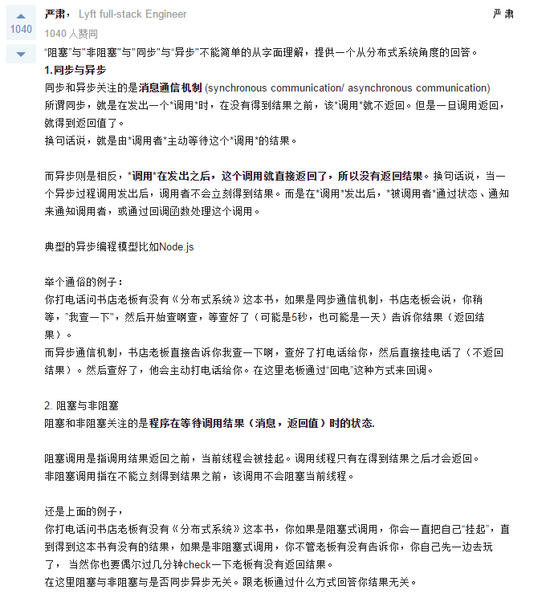
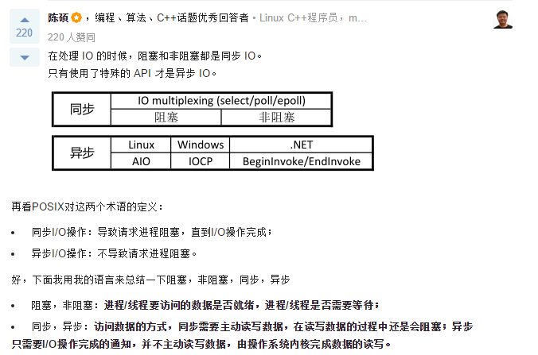
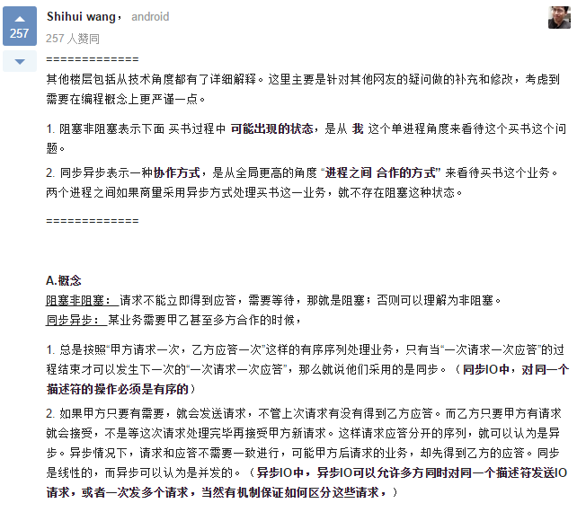
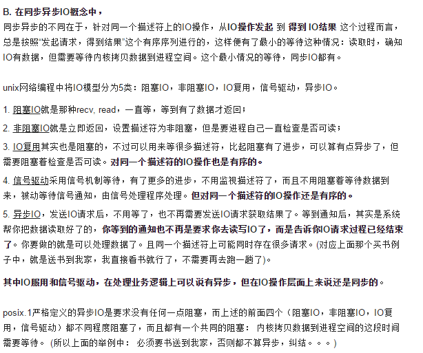
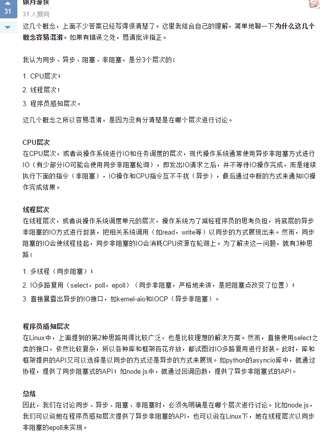

## 关于同步、异步与阻塞、非阻塞的理解
* http://www.cnblogs.com/Anker/p/5965654.html

### 1、前言
* 前一段时间出去面试，被问到 __同步、异步__ 与 __阻塞、非阻塞__ 的区别。我一时半会没有想出来，作为一个工作三年的人来说，实在很惭愧。我当时理解同步、异步属于两个进程中间的协作关系，例如使用浏览器访问一个网站，需要多次请求服务端，才能加载完整个页面的内容。同步的操作如下： 浏览器首先发送第一个请求，等待服务器回复后，再发送第二个请求，依次类推，直到所有请求完成。 异步的操作如下： 浏览器发送第一个请求，可以不用等待服务器返回，可以继续发送第二个请求。 阻塞与非阻塞属于进程的API执行动作的方式，例如进行需要read数据，阻塞方式操作流程是： 如果没有数据，则read会一直等着数据到来，才能进行后续的动作； 而非阻塞则是read没有到数据后，则可以进行后续的动作，当有数据的时候再回来读取。通常linux网络API默认都是阻塞的，例如connect、send、recv等。回答后感觉自己心里没有底，底层的关系到底是什么样的，比较虚，没能深入理解。

### 2、深入理解分析　　
* 回来以后，赶紧上网好好查查，加深学习一下。这两个概念在工作中经常用到这些，例如在 linux __网络IO__ 中涉及到如下模型：
    1. 阻塞式IO
    2. 非阻塞式IO
    3. IO多路复用
    4. 信号驱动IO
    5. 异步IO

* 在知乎上面看到一些解释如下：

* 截图如下：
    * 

    * 阻塞 和 非阻塞 本质上都是同步: 

    * 答案三:  

    * 

### 3、总结
#### 异步就是异步
* 网上有许多I/O模型的相关文章, 主要涉及四个概念: 同步(synchronous),  异步(asynchronous),  阻塞(blocking) 和 非阻塞(non-blocking). 有些文章将这四个作了两两组合, 于是有了: 异步阻塞 和   异步非阻塞 , 可以很明确地说, __这完全是牵强之理解__. 无论是 <Unix网络编程>一书中所列的I/O模式, 还是POSIX标准, 都没有提这两个概念. __异步 就是异步! 只有 同步 时才有阻塞和非阻塞之分.__

#### 阻塞和非阻塞
* 我们说 __阻塞__ 和 __非阻塞__ 时, 要区分场合范围:
    * 比如 Linux中说的 非阻塞I/O 和 Java 的 NIO1.0 中的 非阻塞I/O _不是相同的概念_. 

    * 从最根本来说, __阻塞__ 就是进程 "被" 休息, CPU处理其它进程去了. 

    * __非阻塞__ 可以理解成: 将大的整片时间的阻塞分成N多的小的阻塞, 所以进程不断地有机会 "被" CPU光顾, 理论上可以做点其它事. 

    * 看上去 Linux非阻塞I/O 要比阻塞好, 但 CPU 会很大机率因 socket 没数据而空转. 虽然这个进程是爽了, 但是从整个机器的效率来说, 浪费更大了!  Java NIO1.0 中的非阻塞I/O中的 `Selector.select()` 函数还是阻塞的, 所以不会有无谓的CPU浪费.

#### 异步
* __异步__ 可以说是 I/O 最理想的模型: CPU的原则是, 有必要的时候才会参与, 既不浪费, 也不怠慢.

* 理想中的 _异步I/O_: Application 无需等待 socket 数据(也正是因此进程而被 "休息"), 也无需 copy socket data, 将由其它的同学(理想状态, 不是CPU) 负责将 socket data copy 到 Appliation 事先指定的内存后, 通知一声 Appliation (一般是 __回调函数__).

* copy socket data, Application是不用做了, 但事情总是需要做, 不管是谁做, CPU是否还是要花费精力去参与呢?

* 可以用 "内存映射" 以及 DMA 等方式来达到 "不用CPU去参与繁重的工作" 的目的. "内存映射" 是不用copy, 而DMA是有其它芯片来代替CPU处理.

### 总结
* 同步：执行一个操作之后，等待结果，然后才继续执行后续的操作。

* 异步：执行一个操作后，可以去执行其他的操作，然后等待通知再回来执行刚才没执行完的操作。

* 阻塞：进程给CPU传达一个任务之后，一直等待CPU处理完成，然后才执行后面的操作。

* 非阻塞：进程给CPU传达任我后，继续处理后续的操作，隔断时间再来询问之前的操作是否完成。这样的过程其实也叫 _轮询_。

* 阻塞、非阻塞、多路IO复用，__都是同步IO__， __异步必定是非阻塞的__，所以不存在异步阻塞和异步非阻塞的说法。
    * 真正的异步IO需要CPU的深度参与;
    * 换句话说，只有用户线程在操作IO的时候根本不去考虑IO的执行全部都交给CPU去完成，而自己只等待一个完成信号的时候，才是 __真正的异步IO__;
    * 所以，拉一个子线程去轮询、去死循环，或者使用 `select、poll、epool`，__都不是异步__。

### 参考网址：
https://www.zhihu.com/question/19732473
https://www.zhihu.com/question/27965282
http://www.smithfox.com/?e=191
https://zhuanlan.zhihu.com/p/21416728
http://blog.csdn.net/dinglang_2009/article/details/50461697
