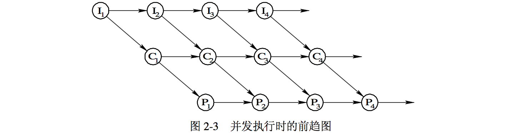

## 进程管理
* http://liucw.cn/2018/01/29/%E6%93%8D%E4%BD%9C%E7%B3%BB%E7%BB%9F/%E8%BF%9B%E7%A8%8B%E7%AE%A1%E7%90%86/

* __进程__: 作为资源分配和独立运行的基本单位都是进程。操作系统所具有的四大特征(__并发、共享、虚拟和异步__)也都是基于进程而形成的，并可从进程的观点来研究操作系统。

### 进程的基本概念
* 在未配置 OS 的系统中，程序的执行方式是 _顺序执行_，即必须在一个程序执行完后，才允许另一个程序执行;
　
* 在多道程序环境下，则允许多个程序 __并发执行__。程序的这两种执行方式间有着显著的不同。也正是程序并发执行时的这种特征，才导致了在操作系统中引入进程的概念。

### 程序的顺序/并发执行
1. 程序的顺序执行
    * 通常可以把一个应用程序分成若干个程序段，在各程序段之间，必须按照某种先后次序顺序执行，仅当前一操作(程序段)执行完后，才能执行后继操作

    * 特征:
        1. 顺序性: 处理机的操作严格按照程序所规定的顺序执行，即每一操作必须在上一个操作结束之后开始。

        2. 封闭性: 程序是在封闭的环境下执行的，即程序运行时独占全机资源，资源的状态(除初始状态外)只有本程序才能改变它。程序一旦开始执行，其执行结果不受外界因素影响。

        3. 可再现性: 只要程序执行时的环境和初始条件相同，当程序重复执行时，不论它是从头到尾不停顿地执行，还是“停停走走”地执行，都将获得相同的结果。

2. 前趋图
    * 前趋图(Precedence Graph)是一个 __有向 无循环 图__，记为 DAG(Directed Acyclic Graph)，用于描述进程之间执行的前后关系

3. 程序的 __并发__ 执行及其特征
    * 特征: 程序的并发执行，虽然提高了系统吞吐量，但也产生了下述一些与程序顺序执行时不同的特征。

    1. 间断性:
        * 程序在并发执行时，由于它们共享系统资源，以及为完成同一项任务而相互合作，致使在这些并发执行的程序之间，形成了相互制约的关系;

        * 例如，图中的 I、C 和 P 是三个相互合作的程序，当计算程序完成 C1 的计算后，如果输入程序 I 尚未完成 I2 的处理，则 计算程序就无法进行 C2 的处理，致使计算程序必须暂停运行;

        * 简而言之，相互制约将导致并发程序具有 “执行—暂停—执行” 这种间断性的活动规律

    2. 失去封闭性:
        * 程序在并发执行时，是多个程序共享系统中的各种资源，因而这些资源的状态将由多个程序来改变，致使程序的运行失去了封闭性。这样，某程序在执行时，必然会受到其它程序的影响。例如，当处理机这一资源已被某个程序占有时，另一程序必须等待。

    3. 不可再现性
        * 程序在并发执行时，由于失去了封闭性，也将导致其再失去可再现性。
　　
* 上述情况说明，程序在并发执行时，由于失去了封闭性，其计算结果已与并发程序的执行速度有关，从而使程序的执行失去了可再现性，亦即，程序经过多次执行后，虽然它们执行时的环境和初始条件相同，但得到的结果却各不相同

* 

### 进程的特征
1. 进程的特征:
    * 在多道程序环境下，程序的执行属于并发执行，此时它们将失去其封闭性，并具有间断性及不可再现性的特征。这决定了通常的程序是不能参与并发执行的，因为程序执行的结果是不可再现的。这样，程序的运行也就失去了意义。为使程序能并发执行，且为了对并发执行的程序加以描述和控制，人们引入了“__进程__”的概念。

    1. 结构特征:
        * 通常的程序是不能并发执行的。为使程序(含数据)能独立运行，应为之配置一 __进程控制块__，即 PCB(Process Control Block);
        * 由程序段、相关的数据段和 PCB 三部分便构成了进程实体。
        * 在许多情况下所说的进程，实际上是指进程实体，例如，所谓创建进程，实质上是创建进程实体中的 PCB;而撤消进程，实质上是撤消进程的 PCB

    2. 动态性
        * 进程的实质是进程实体的一次执行过程，因此，动态性是进程的最基本的特征。动态性还表现在:“它由创建而产生，由调度而执行，由撤消而消亡”。
        * 可见，进程实体有一定的生命期，而 _程序则只是一组有序指令的集合_，并存放于某种介质上，其本身并不具有运动的含义，因而是静态的。

    3. __并发性__
        * 指多个进程实体同存于内存中，且能在一段时间内同时运行。并发性是进程的重要特征，同时也成为 OS 的重要特征。
        * 引入进程的目的也正是为了使其进程实体能和其它进程实体并发执行;而程序(没有建立 PCB)是不能并发执行的。

    4. 独立性
        * 在传统的 OS 中，独立性是指进程实体是一个能独立运行、独立分配资源和独立接受调度的基本单位。凡未建立 PCB 的程序都不能作为一个独立的单位参与运行。

    5. __异步性__
        * 这是指进程按各自独立的、不可预知的速度向前推进，或说进程实体按异步方式运行。

2. 进程的定义
    * 现在我们再来讨论进程的定义。曾有许多人从不同的角度对进程下过定义，其中较典型的进程定义有:
    * a). 进程是程序的一次执行。
    * b). 进程是一个程序及其数据在处理机上顺序执行时所发生的活动。
    * c). 进程是程序在一个数据集合上运行的过程，它是系统进行资源分配0和调度的一个独立单位。
    * 在引入了进程实体的概念后，我们可以把传统 OS 中的进程定义为:“进程是进程实体的运行过程，是系统进行资源分配和调度的一个独立单位”。

### TODO: 未完待续