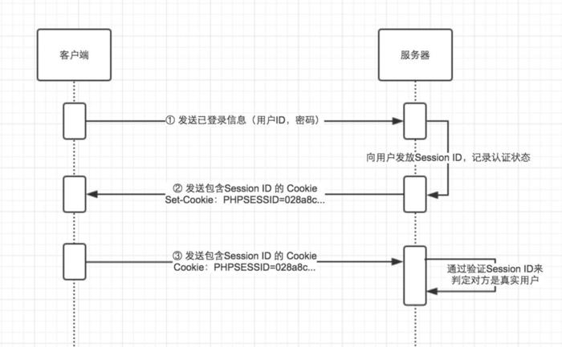
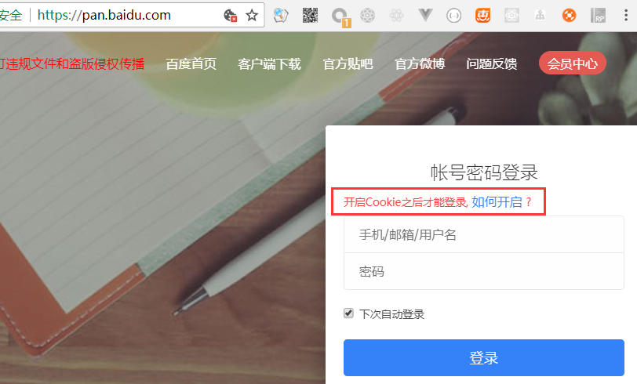

## Session原理
* https://www.jianshu.com/p/2b7c10291aad


### 无状态的 HTTP 协议
* 还记得每当入门一门 Web 端语言的进行服务器端开发的时候，仅次于「Hello World」的 demo 就是「登录功能」了。实现登录功能很简单，验证客户端发送过来的账户和密码，如果通过验证就把用户塞进 `session` 中，然后在后续的访问中，只需检测 `session` 是否有这个用户就能知道用户是否登录了。Session 的中文翻译为：「会话」，只属于某一个客户端和某一个服务器端沟通的工具。但，计算机网络老师又说了，HTTP 协议是无状态的，怎么能记录用户的登录状态呢？

* 鉴于 __HTTP 是无状态协议__，之前已认证成功的用户状态是无法通过协议层面保存下来的，既，无法实现状态管理，因此即使当该用户下一次继续访问，也无法区分他和其他的用户。于是我们会 __使用 Cookie 来管理 Session__，以弥补 HTTP 协议中不存在的状态管理功能。


### 利用 Cookie 管理 Session


* 步骤 1：客户端把用户 ID 和密码等登录信息放入报文的实体部分，通常是以 POST 方法把请求发送给服务器。

* 步骤 2：_服务器_ 会发放用以识别用户的 __Session ID__。通过验证从客户端发送过来的登录信息进行身份验证，然后把用户的认证状态与 Session ID 绑定后记录在 _服务器端_。向客户端返回响应时，会在首部字段 `Set-Cookie` 内写入 Session ID。

* 步骤 3：_客户端_ 接收到从服务器端发来的 `Session ID` 后，会将其作为 `Cookie` 保存在本地。__下次向服务器发送请求时，浏览器会自动发送 Cookie，所以 Session ID 也随之发送到服务器__。服务器端可通过验证接收到的 Session ID 识别用户和其认证状态。


### 为 Cookie 服务的 HTTP 首部字段
* `Set-Cookie`
* `Cookie`

* __Set-Cookie__:
    * 服务器管理状态使用到的字段，用于响应首部
    * 一则响应首部的 Set-Cookie 字段：`Set-Cookie: status=enable; expires= Tue, 05 Jul 2011 07:26:31 GMT; path=/; domain=.hackr.jp;`

    * Set-Cookie 字段的属性：
    ```
    属性	        说明
    NAME=VALUE	    赋予 Cookie 的名称和其值（必须项）
    expires=DATE	Cookie 的有效期（若不明确指定则默认为浏览器关闭前为止）
    path=PATH	    将服务器上的文件目录作为 Cookie 的适用对象（若不指定则默认为文档所在的目录）
    domain=域名	    作为 Cookie 适用对象的域名（若不指定则默认为创建 Cookie 的服务器的域名）
    Secure	        仅在 HTTPS 安全通信时才会发送 Cookie
    HttpOnly	    加以限制，使 Cookie 不能被 Javascript 脚本访问
    ```

* __Cookie__:
    * 首部字段 Cookie 会告知服务器，当客户端想获得 HTTP 状态管理支持时，就会在请求中包含从服务器接收到的 Cookie。接收到多个 Cookie 时，同样可以以多个 Cookie 形式发送。


### 拓展
* 如何验证 session 是借助浏览器的 cookie 来管理呢 -- 关闭浏览器的 cookie 功能你就会发现大多数网站的登陆功能都无法使用
    * 浏览器 cookie 关闭: https://jingyan.baidu.com/article/4f7d5712f2d33b1a20192727.html

    * 
