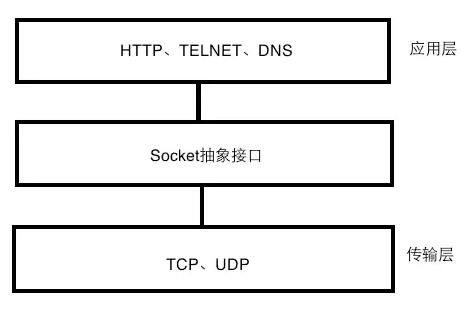

## 区分HTTP、Socket与TCP
* https://www.duoluodeyu.com/2359.html

* HTTP、Socket、TCP这三个概念在网络开发中经常被提及，也是比较容易被混淆的概念，这三者在TCP/IP协议族中的位置关系：

* 其中，
    * HTTP是 **应用层** 的协议，更靠近客户端，也是开发中最常用的一个网络协议;
    * TCP是 **传输层** 的协议，学过网络的都知道，该层还有一个_UDP协议_;
    * Socke t是从传输层上抽象出来的一个 **抽象层，本质是接口，并不是传统意义上的网络协议**，所以从协议簇来说，三者还是很好区分的。那么HTTP连接、TCP连接、Socket连接有什么区别?

### 1、TCP连接与HTTP连接的区别
* 在网络分层中，HTTP协议是基于TCP协议的，_客户端往服务端发送一个HTTP请求时第一步就是要建立与服务端的TCP连接_，也就是 **先三次握手**，握手成功以后才能进行数据交互。从HTTP 1.1开始支持持 **长连接**，也就是一次TCP连接以后，客户端可以发送多次的HTTP请求给服务器端。

* 总结：HTTP基于TCP

### 2、TCP连接与Socket连接的区别
* Socket层只是在TCP/UDP传输层上做的一个抽象接口层，因此 _一个Socket连接可以基于TCP连接，也有可能基于UDP_。
    * 基于TCP协议的Socket连接同样需要通过三次握手建立连接，是可靠的;
    * 基于UDP协议的Socket连接不需要建立连接的过程，它是不管对方能不能收到，都会将数据发送过去，因此它是不可靠的连接，大多数的即时通讯IM都是基于后者实现的。

* 总结：Socket也可基于TCP

### 3、HTTP连接与Socket连接的区别
* HTTP是 **短连接**，Socket(基于TCP协议的)是 **长连接**。虽然HTTP1.1开始支持持长连接，但仍无法保证始终连接。而Socket连接一旦建立TCP三次握手，除非一方主动断开，否则连接状态一直保持。

* HTTP连接服务端无法主动发消息，只有发起请求服务端才会响应。而Socket连接双方请求的发送先后没有限制。这点就非常重要，这将 __决定二者分别适合应用在什么场景下__。
    * HTTP采用 **"请求-响应"** 机制，在客户端还没发送消息给服务端前，服务端无法推送消息给客户端。**必须** 满足客户端发送消息在前，服务端回复在后;
    * Socket连接双方类似P2P的关系，一方随时可以向另一方发送消息。

### 4、什么时候该用HTTP，什么时候该用Socket
* 在网络开发中，经常要考虑用HTTP还是用Socket。那么总结一下：

* 用HTTP的情况：双方不需要时刻保持连接在线，比如客户端获取服务器端资源、文件上传等。

* 用Socket的情况：大部分即时通讯应用、聊天室、苹果APNs等
