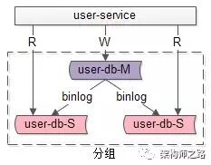
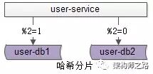
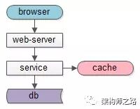

## 数据库读写分离架构，为什么我不喜欢
* http://database.51cto.com/art/201801/563213.htm

* __读写分离__，解决“数据库读性能瓶颈”问题；

* __水平切分__，解决“数据库数据量大”问题；

* 对于互联网大数据量，高并发量，高可用要求高，一致性要求高，前端面向用户的业务场景， 微服务 __缓存架构__，可能比数据库读写分离架构更合适。

```
RD：单库数据量太大，数据库扛不住了，我要申请一个数据库从库，读写分离。
DBA：数据量多少？
RD：5000w左右。
DBA：读写吞吐量呢？
RD：读QPS约200，写QPS约30左右。
```
* 上周在公司听到两个技术同学讨论，感觉对读写分离解决什么问题没有弄清楚，有些奔溃。
* 另，对于互联网某些业务场景，并不是很喜欢数据库读写分离架构，一些浅见见文末。


## 一、读写分离
* 什么是数据库读写分离？
    * 

    * 答：一主多从，读写分离，主动同步，是一种常见的数据库架构，一般来说：
        * 主库，提供数据库写服务

        * 从库，提供数据库读服务

        * 主从之间，通过某种机制同步数据，例如 mysql 的 binlog

        * 一个组从同步集群通常称为一个“分组”。

* 分组架构究竟解决什么问题？
    * 答：大部分互联网业务读多写少，数据库的读往往最先成为性能瓶颈，如果希望：
    
    * 线性提升数据库读性能

    * _通过消除读写锁冲突提升数据库写性能_

    * 此时可以使用分组架构。    

* 一句话，分组主要解决 “数据库 __读性能__ 瓶颈”问题，在数据库扛不住读的时候，通常读写分离，通过增加从库线性提升系统读性能。


## 二、水平切分
* 什么是数据库水平切分？
    * 

* 答：水平切分，也是一种常见的数据库架构，一般来说：
    * 每个数据库之间没有数据重合，没有类似binlog同步的关联

    * 所有数据并集，组成全部数据

    * 会用算法，来完成数据分割，例如“取模”

    * 一个水平切分集群中的每一个数据库，通常称为一个“分片”。

* 水平切分架构究竟解决什么问题？
    * 答：大部分互联网业务数据量很大，单库容量容易成为瓶颈，如果希望：

    * 线性降低单库数据容量

    * 线性提升数据库 __写性能__

    * 此时可以使用水平切分架构。

* 一句话总结，水平切分主要解决 “数据库 __数据量大__” 问题，在数据库容量扛不住的时候，通常水平切分。


## 三、为什么不喜欢读写分离
* 对于互联网大数据量，高并发量，高可用要求高，一致性要求高，前端面向用户的业务场景，如果数据库读写分离：
    * 数据库连接池需要区分：读连接池，写连接池

    * 如果要保证读高可用，读连接池要实现故障自动转移

    * 有潜在的主库从库一致性问题

* 如果面临的是“读性能瓶颈”问题，增加 __缓存__ 可能来得更直接，更容易一点
    * 

    * 关于成本，从库的成本比缓存高不少

    * 对于云上的架构，以阿里云为例，主库提供高可用服务，从库不提供高可用服务

* 所以，上述业务场景下，楼主 _建议使用缓存架构来加强系统读性能，替代数据库主从分离架构_。

* 当然，使用缓存架构的潜在问题：如果缓存挂了，流量全部压到数据库上，数据库会雪崩。不过幸好，云上的缓存一般都提供高可用的服务。


## 四、总结
* 读写分离，解决“数据库读性能瓶颈”问题

* 水平切分，解决“数据库数据量大”问题

* 对于互联网大数据量，高并发量，高可用要求高，一致性要求高，前端面向用户的业务场景，微服务缓存架构，可能比数据库读写分离架构更合适
