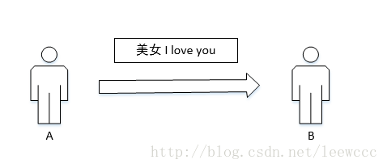
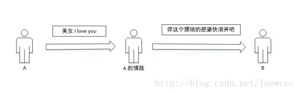
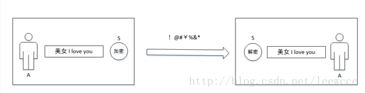
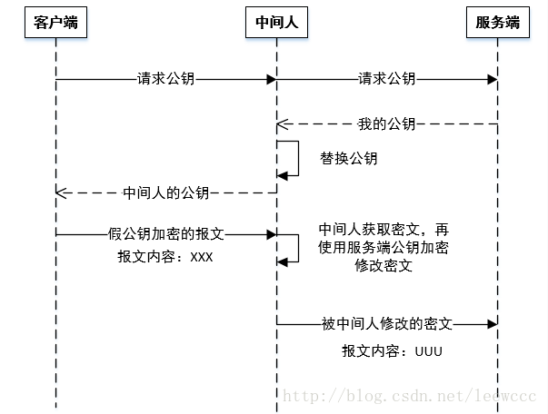

## 理解 HTTPS
* https://blog.csdn.net/leewccc/article/details/58593017

### 概念
* __HTTPS__（Hypertext Transfer Protocol Secure），顾名思义就是在 HTTP 协议的基础上加多一层安全的机制，本质上是 HTTP + SSL/TLS。

### 什么是安全
* 我们都知道 HTTP 协议是用于网络通信的，用户 A 向 用户 B 要通信，就需要通过 HTTP 协议来发送报文，然后报文经过多个路由器的转发到达用户 B，这样的一个过程实际上就是一次通信过程。 

* 那么回到我们刚才说的那次通信，用户 A 发送信息给用户 B 时，需要通过网络传输，而不是直接到达，那么就可能存在在传输过程中，报文被调包的情况，本来 A 要和 B 表白的：“美女，I love you”，结果一个恶意用户改成 “你这个猥琐的肥婆快滚开吧”，那这样 A 的表白不就泡汤了，分分钟想杀人。

* 报文掉包前： 

* 报文掉包后: 

* 因此使用 HTTP 协议进行通信时，存在这种不安全的问题，那么我们 __安全的目标应该是要保证用户 A 发送给用户 B 的信息不会被改变__，而且只有 A 和 B 知道通信的内容，即保证通信内容只有发送者和接受者可知，即使被别人获取，别人也不知道。

### 如何保证安全
* 既然上面说到我们的安全是要保证通信内容不会泄露给第三方，那么我们第一想到的做法就是加密。加密算法有两种，分别是 __对称加密算法__ 和 __非对称加密算法__

#### 对称加密算法
* 对称加密算法，客户端在发送报文时，先将通信报文使用一个密钥 s 进行加密，服务端在收到这个报文时，使用同一个密钥 s 进行解密，其过程就如下：
    * 

* 从该过程可以看出，使用对称加密算法时，__双方都必须持有同一把钥匙 S__ ，然后使用钥匙对报文进行加密解密，只要第三方不知道你的钥匙 S 是什么，即使他获取到报文，他也是不知道报文的内容是什么。 

* 第一个问题就来了，上面提到双方都需要拥有钥匙 S，那么如何才能让对方获得钥匙？
    * 很显然，如果只有两个固定的双方通信，那么在开发过程中，只需要通过协商好钥匙，这样就能保证双方都有钥匙。可是在现今的 Web 通信模型中，我们大多数是采用 _浏览器-服务器这样的 BS 结构模型来开发，显然不可能通过事先约定好密钥来进行开发_。 
    * 那么另外一种方法则是，在客户端第一次与服务端通信的时候，服务端把密钥发给客户端就可以了。但这又引发另一个新的问题，发密钥的过程没有加密，别人一样可以盗取密钥。有人可能会说再对密钥进行对称加密，可这不就成了一个鸡蛋生鸡鸡生鸡蛋无限循环的问题了吗。显然我们需要找到一个方法来保证这次发密钥的过程。

* 先放下第一个问题，现在第二个问题来了，报文是通过钥匙进行加密解密的，在 Web 模型中，对于不同的客户端都使用同一个钥匙？ 

* 细想一下，__如果服务器与所有客户端都使用相同的密钥，那和没有加密有什么区别__，恶意用户和你一样拥有相同的密钥，一样可以盗取信息。因此使用相同的密钥是不科学的，对于不同的客户端应该使用不同的钥匙。

* 因此，综上所述，我们需要解决两个问题：
    1. 用怎样的加密算法来保证不同客户端有不同的钥匙
    2. 如何告知双方采用的是哪种加密算法

### 随机 key
* 第一个问题的重点核心是不同客户端要有不同的钥匙，那么想到的第一个解决方法当然是使用随机数生成钥匙啦。通信时由客户端生成一个密钥，然后根据密钥对报文进行加密，这样就能保证不同客户端使用的是不同的钥匙

### 非对称加密
* 从上一个问题，我们可以知道我们使用 __随机数密钥__ 来进行加密解密，因为密钥是随机的，所以我需要告知服务器我采用哪一种加密算法；前面已经提及到对密钥进行对称加密再发送是一种鸡蛋生鸡鸡生鸡蛋的问题，不可取。 

* 那么，在加密算法中还有一种 __非对称加密算法__，它是一个 __公钥密钥对__，只有一个用户拥有 __密钥 S__， __公钥 P__ 公开给其他用户，用公钥加密的报文只有拥有密钥才能解密，反之亦然。
    * __公钥加密, 私钥解密__
    * _客户端_ 只需要使用 _服务端_ 的公钥对密钥进行加密，则能保证密钥不被泄露。 

### 如何发送公钥
* 从上面我们已经可以知道通信过程中是采用随机密钥加密算法和非对称加密传输密钥的方法，这一前提是服务端发送公钥给客户端。服务端发送公钥仍存在安全问题，如下：
    * 

* 既然存在公钥被调包的问题，因此我们不能使用直接发送公钥的方法。因此 HTTPS 则引入第三方机构，先 __把公钥采用第三方机构的私钥加密__，然后把加密后的公钥发给客户端，客户端使用第三方机构的公钥进行解密获得服务端的公钥，这也是所说的 __数字证书__。

### 数字证书
* 所谓的数字证书，就是 __服务端__ 拿自己的公钥去第三方机构申请证书，证书就是加密后的服务器公钥。这样恶意用户就无法使用自己的公钥去替换服务端的公钥，因为客户端使用第三方机构的公钥解密不了。 

* 但是，另外一个问题也来了，上面只是说恶意用户不能直接替换加密后的公钥，因为客户端需要使用第三方机构的公钥解密，直接替换会解密失败。但是如果恶意用户也经过第三方机构证书授权，它可以直接替换证书为他的证书，这样客户端接受到证书解密后得到是恶意用的公钥。 

* 那么该问题主要是客户端不知道发来的证书是否服务端发来的，因此需要引入验证方法 —— __数字签名__ 

* 在获得证书后，可以根据证书的内容来计算 _证书编号_，若计算出的证书编号与证书上的证书编号一致，则代表是安全一致的。

### 总结
* HTTPS 协议相当于 HTTP + _SSL/TLS_，在 HTTP 协议的基础上增加一层安全机制。该安全机制主要是为了保护通信内容不会被第三方知道，因此需要对信息进行加密。 

* 由于在 当今 web 模型中，不同客户端需要使用不同的密钥，因此客户端采用随机数密钥生成方法。但由于密钥是由客户端生成，需要告诉客户端，因此通过非对称加密的方式，客户端使用服务端的公钥对内容进行加密，服务端再使用密钥进行解密。 
　
* 但是该种方法在传送公钥的时候，可能会被调包公钥，因此采用了数据证书的方式来保证来对公钥进行加密，并且使用数字签名来验证证书是否合法且由服务端发送。

### HTTPS 与 HTTP 的区别
* 其实上面介绍了这么多，都是基于 HTTPS 通信的原理。其实，HTTPS 与 HTTP 功能是一样的，都是用于网络通信，前者由于添加了安全机制，因此他们的通信方式不同，这也是他们的主要区别。

* 基于 HTTP 通信： 有过 web 开发经验的人，应该都对基于 HTTP 通信方式是如何的，无非是以下过程：
    1. 客户端首先与服务端建立一个 TCP 连接，只需要通过三次握手即可完成建立
    2. 客户端将发送的信息封装成 HTTP 报文，通过 TCP 连接发送到服务端
    3. 服务端收到之后，解析报文数据，对客户端作出响应
    4. 客户端收到响应，关闭 TCP 连接 
    5. 该过程很简单，只是建立连接发数据的过程而已，不涉及其他过程。

* 基于 HTTPS 通信： 但是基于 HTTPS 就并不仅仅是建立连接和发数据了，它还涉及到许多身份验证、加密解密的过程，它的通信过程如下：
    1. 客户端发起 HTTPS 请求
    2. 服务端收到请求后，返回一个数字证书
    3. 客户端在收到证书后，对该证书进行验证
    4. 若证书合法，随机生成用于对称加密的密钥 S
    5. 使用证书中的公钥对密钥 S 进行加密，发送到服务端，服务端保存起来
    6. 使用密钥 S 对报文进行加密
    7. 服务端收到报文使用密钥 S 进行解密
    8. 根据报文进行响应，如此完成一次通信
